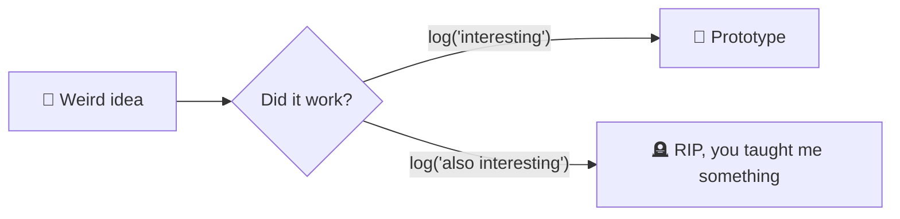

# 🧩 prototypes/


> Where `experiments/` go when they refuse to die quietly.

Something in here survived long enough to earn a real folder structure, an actual dependency file, and — brace yourself — *intentional design decisions*. That's not nothing.

## How something ends up here



## What lives here

Each prototype is a self-contained mini-project:

```
prototypes/
└── name-of-thing/
    ├── README.md          # what it does, why it exists
    ├── src/                # the actual thing
    └── requirements.txt    # or package.json, or Cargo.toml, or whatever cursed toolchain I picked
```

No shared dependencies across prototypes — everyone brings their own snacks.

## Graduation criteria 🎓

A prototype "graduates" out of this repo entirely when it:
- [ ] has tests that aren't just `console.log("it worked??")`
- [ ] survives being shown to another human
- [ ] gets its own repo and a real version number

Until then, it lives here, half-serious, fully caffeinated.

---

*Structurally sound. Emotionally, still figuring it out.*
